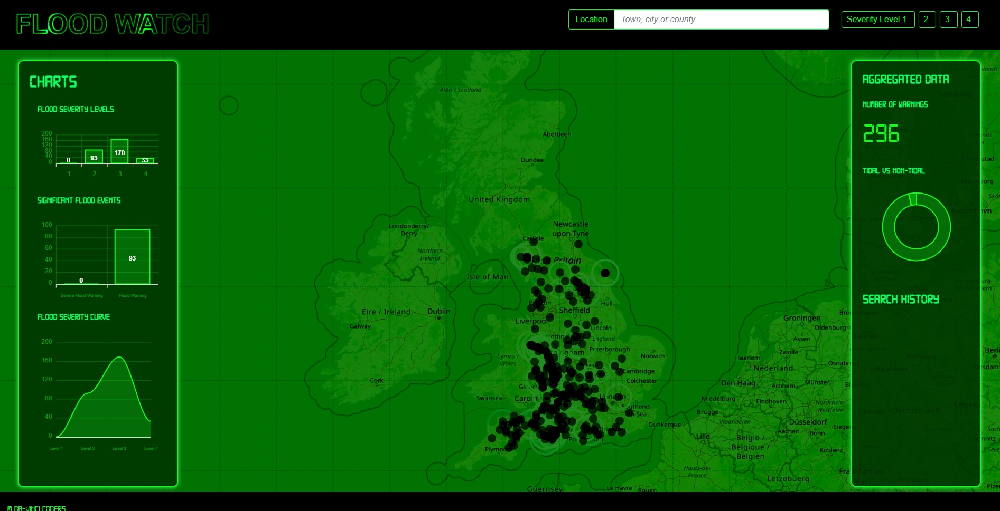
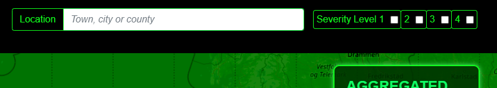
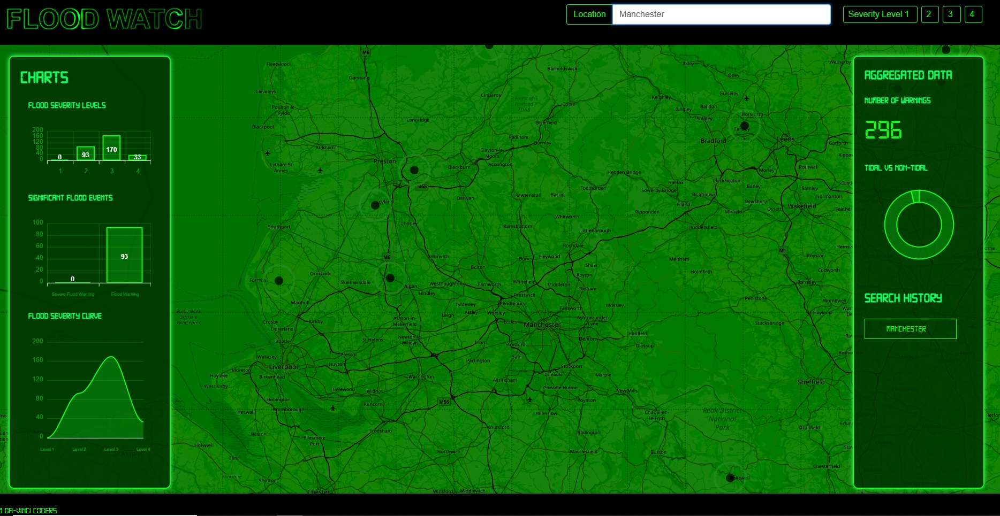
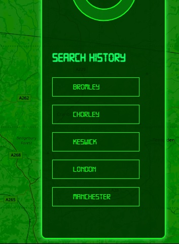
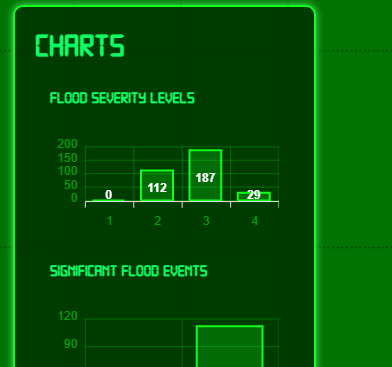

# Flood-Watch

*"The Flood Warning Dashboard"* brought to you by Da-Vinci Coders, a four member team focused on developing eye-catching apps that appeal to wider audiences.

## Description
Flood watch is a browser dashboard that enables the user to search by location for real time flood warnings issued by The Environment Agency (EA), in England. 

The dashboard features a geographic map which shows a general view of all the flood warnings in place at the moment the dashboard loads. 

A focused view of flood warnings can be obtained by setting the following inputs as part of a user-specific flood watch search.

User inputs;

1. Location (*Town, city or county*)
2. Severity: (*Level 1, 2, 3 &/or 4*)

Flood Watch also features charts that display aggregated data, such as; 
* Types of flood warning in place, grouped by severity
* Number of tidal and non-tidal flood warnings
* A counter that displays the total number of flood warnings

Flood watch may appeal to various groups of people, here are some examples;

* As a local authority representative, I want to know of flood warnings in advance so that I can alert residents and plan accordingly within my area of responsibility.

* As a resident in a flood prone area, I want to check whether my family & I and our property are at risk of an imminent flood event so that I can implement an action plan.

* As a business owner working in a flood prone area, I want to check whether my staff and business is at risk of an imminent flood event so that I can implement an action plan.

* As a visitor to an area I, want to know in advance of my travel whether there are any warnings that may affect my travel plans.

* As researcher of climate &/or flood events, I want to check how many flood warnings there are periodically and reference accordingly.

    ### *"Stay on top of flood warnings with Flood Watch!"*

## Table of Contents

- [ 1.0 - Installation](#installation)
- [ 2.0 - Usage](#usage)
- [ 3.0 - Built With](#built-with)
    - [3.1 - APIs Used](#apis-used)
- [ 4.0 - License](#license)
- [ 5.0 - Challenges](#challenges)
- [ 6.0 - Credits](#credit)
- [ 7.0 - Deployed Site](#deployed-site)
- [ 8.0 - Link to Github Repository](#link-to-github-repository)
- [ 9.0 - Badges and Awards](#badges-and-awards)
- [10.0 - Contributors](#contributors)

## Installation
Flood Watch is a browser based app, just ensure that you have a working internet connection & then follow the link in the [deployed site section](#deployed-site) of this readme to launch the dashboard.

Once loaded, you can expect to be greeted with this view of the dashboard;

*A screenshot of the app in it's default state, as viewed in full screen browser (1920 x 1080 display resolution).*

## Usage:

Flood warnings are rendered as black dots pinpointing individual flood warnings on a geographical map *(please note that locations are approximate)*.   

Flood warnings & data are 'real-time' at the point the browser is first loaded. For the latest 'real-time' warnings & data you should reload the browser manually.

Where there are flood warnings in place for a given location, the map will focus on to the area after the user has input the location. 

Flood warnings are sorted into four levels of severity as defined by the Environment Agency;

| Level | Name | Meaning |
| ----------- | ----------- | ----------- |
| 1 | Severe Flood Warning | Severe Flooding, Danger to Life. |
| 2 | Flood Warning | Flooding is Expected, Immediate Action Required. |
| 3 | Flood Alert | Flooding is Possible, Be Prepared. |
| 4 | Warning no Longer in Force | The warning is no longer in force. |

All levels of severity appear on the map by default however the user may isolate the severity levels by selecting the inputs on the top-right of the dashboard, which act as a filter.

A user-specific search of location enables the user to focus on a specific geographic area via the user input: location (in this example Manchester). If there are no flood warnings for the location then there are no floods to focus on, in which case the user may enter another location to check.

The app keeps a history of last five user location searches in their browser, so they can 'click' the search history button on recent searches rather than typing out the location again.

## Built With

Flood watch was built using;

* 
* 
* 
*  
* 
* 
* 

## APIs Used

Flood Watch utilises the following API's;

* **Environment Agency Real Time flood-monitoring API** - All flood warnings & flood warning data are 'called' using this API - https://environment.data.gov.uk/flood-monitoring/doc/reference
* **OpenStreetMap** - The map is rendered using this API as part of the OpenLayers map library - https://www.openstreetmap.org/#map=6/52.763/-2.285&layers=C & https://openlayers.org/
* **OpenCage Geocoding API** - The user search locations are translated into longitudinal & latitudinal values using this API - https://opencagedata.com/api

N.B. Please don't rely solely on Flood Watch to obtain your flood warnings! Flood watch is not designed to be the definitive &/or sole source for critical flood warnings &/or of flood warning data. You should always consider official recommendations & guidelines pertaining to flood warnings & floods! 

## Challenges:
One of the biggest challenges of the project was rendering the map with the pinpoints & making it focus on user input locations. Getting the map to work in the context of the dashboard & according to the project requirements as defined by the group a challenging task. 

Paul Ashby's main area of focus on this project was getting the maps to work as planned. Our chosen map rendering library (OL maps) generated various files with unique references for every instance of the maps that was developed during the project. 

The [recommended way](https://openlayers.org/download/) to use OpenLayers is to install the npm package locally and run <kbd>create</kbd> to generate a development folder. As we were initially unsure that the OpenLayers library would pan out, we felt it would be cleaner to use a [separate repo](https://github.com/paulashby/flood-watch-map) so as not to pollute the codebase. Updates were regularly pushed to the main Flood Watch repo for integration testing.

Isolating & calling the relevant data from the EA API JSON objects was dealt with by Sam Brooke, the following example shows how the flood severityLevel values were indexed and then counted depending on their value;

   
            
    var severity = response.items.map((item) => item.severityLevel);

    var severity1 = 1;
    var severity2 = 2;
    var severity3 = 3;
    var severity4 = 4;

    var counter1 = 0;
    var counter2 = 0;
    var counter3 = 0;
    var counter4 = 0;

    for (var i = 0; i < severity.length; i++) {
      //  console.log(response.items[i].severityLevel)

      if (severity[i] == severity1) {
        counter1++;
      }

      else if (severity[i] == severity2) {
        counter2++;
      }

      else if (severity[i] == severity3) {
        counter3++;
      }

      else if (severity[i] == severity4) {
        counter4++;
      }

    };

This is how the chart render after adding the counter variables to the Apex Chart objects in the chart.js file created for the project.

## License:
MIT License

Copyright (c) [2023] [Da-Vinci Coders]

Permission is hereby granted, free of charge, to any person obtaining a copy
of this software and associated documentation files (the "Software"), to deal
in the Software without restriction, including without limitation the rights
to use, copy, modify, merge, publish, distribute, sublicense, and/or sell
copies of the Software, and to permit persons to whom the Software is
furnished to do so, subject to the following conditions:

The above copyright notice and this permission notice shall be included in all
copies or substantial portions of the Software.

THE SOFTWARE IS PROVIDED "AS IS", WITHOUT WARRANTY OF ANY KIND, EXPRESS OR
IMPLIED, INCLUDING BUT NOT LIMITED TO THE WARRANTIES OF MERCHANTABILITY,
FITNESS FOR A PARTICULAR PURPOSE AND NONINFRINGEMENT. IN NO EVENT SHALL THE
AUTHORS OR COPYRIGHT HOLDERS BE LIABLE FOR ANY CLAIM, DAMAGES OR OTHER
LIABILITY, WHETHER IN AN ACTION OF CONTRACT, TORT OR OTHERWISE, ARISING FROM,
OUT OF OR IN CONNECTION WITH THE SOFTWARE OR THE USE OR OTHER DEALINGS IN THE
SOFTWARE.

## Credits
Flood Watch is an educational project, completed as part of the Trilogy Skills Bootcamp in Front-End Web Development. Thank you to Philip Howle (course Instructor) and Brooke Love (https://github.com/brookelove), our group teaching assistant. 

Flood Watch dashboard uses Environment Agency flood and river level data from the real-time data API (Beta). Please see [license](https://www.nationalarchives.gov.uk/doc/open-government-licence/version/3/).

All contributors to the OpenLayers library. Please see [license](https://tldrlegal.com/license/bsd-2-clause-license-(freebsd)).

OpenStreetMap® is open data, licensed under the [Open Data Commons Open Database License (ODbL)](https://opendatacommons.org/licenses/odbl/) by the OpenStreetMap Foundation (OSMF).

The 'Digital-7' font has been used to display text in the Flood Watch dashboard (credit to author: Alexander Sizenko (aka Style-7))

## Deployed Site

* https://sam010000101.github.io/flood-watch/

## Link to Github Repository
* https://github.com/Sam010000101/flood-watch

## Badges and Awards:
This is the **Da Vinci Coders** first project together, their achievements were recognised by their bootcamp peers & TA's through the following awards;

**"The Peoples Choice Award"** voted for by their peers as the best app in the class (out of nine projects).

Recognised as the app having the **best user experience & interface**, voted for by the Bootcamp TA's (out of nine projects).

## Contributors:
Da-Vinci Coders
* Sam Brooke - https://github.com/Sam010000101
* Paul Ashby - https://github.com/paulashby
* Damien Nsoh Ayine - https://github.com/Damiennsoh
* Dayo Adekunle - https://github.com/Data202
